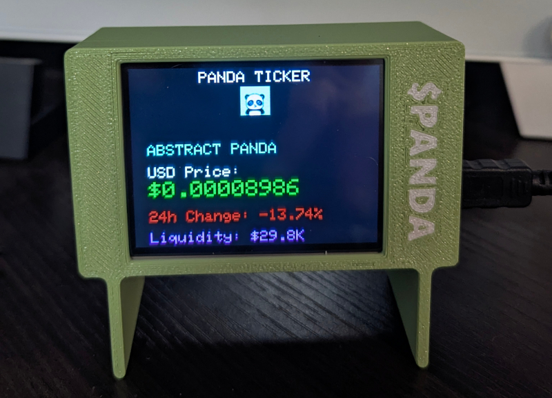

 

  
	
# 🐼 PandaToken Tracker
PandaToken Tracker is a sleek, ESP32-powered display project that pulls real-time token data from the DexScreener API. With a vibrant TFT interface, embedded Wi-Fi setup via captive portal, and support for flashing via web tools, it’s ideal for crypto enthusiasts, token creators, or hardware NFT projects.

 

---

## ✨ Features

- 📡 **Live Token Tracking** via DexScreener
- 🖼️ Custom 38×38 Panda Logo (JPEG) on boot
- 🔁 Auto-refresh every **30 seconds**
- 🔓 **Wi-Fi Manager** for first-time setup and reconfig
- 💸 Displays:
  - Token Name + Symbol
  - USD Price (live)
  - 24h % Change (color-coded)
  - Liquidity (formatted as K/M/B)
- 🔌 **OTA-ready architecture** for future updates
- 📦 **Pre-flash ready** – ideal for distribution/sales

---

## 🚀 Quick Start

### 🛠️ Hardware Requirements
- ESP32 development board
- 2.8" TFT display (e.g., ILI9341 or ST7789)
- USB power
- (Optional) microSD, buttons, or touch for future expansion

### 🧩 Required Libraries
Install via Arduino Library Manager:

- `WiFiManager` Library found [HERE](https://github.com/tzapu/WiFiManager)
- `TFT_eSPI` Library found [HERE](https://github.com/Bodmer/TFT_eSPI)
- `TJpg_Decoder` Library found [HERE](https://github.com/Bodmer/TJpg_Decoder)
- `ArduinoJson` Info found [HERE](https://arduinojson.org/?utm_source=meta&utm_medium=library.properties)
- `WiFi` (built-in) Info found [HERE](https://docs.arduino.cc/libraries/wifi/) 

---

## 🧪 Flashing the Firmware

### 👨‍💻 Option 1: Arduino IDE
1. Open `PandaToken-Tracker.ino`
2. Select your board (e.g., `LOLIN D32`)
3. Flash via USB

### 🌍 Option 2: Web Flasher (Recommended)
Use our hosted **Web Flasher** tool — no IDE required!

> 🔗 **[Launch Web Flasher](https://#.com)**  

---

## 📶 Wi-Fi Setup (First-Time or Reset)

If no saved credentials are found:

1. Device boots in **Access Point mode**
2. Connect to SSID: `PANDA-TICKER`  
   Password: `trackmypanda`
3. Captive portal appears
4. Choose your network, enter password
5. Device reboots and connects

---

## 📁 File Overview

| File | Description |
|------|-------------|
| `PandaToken-Tracker.ino` | Main logic & rendering |
| `wifi_setup.h` | Handles WiFiManager portal |
| `panda_logo.h` | 38x38 JPEG image byte array |

---

## 🧱 Built With

- ESP32 Arduino Core
- DexScreener API
- WiFiManager
- TFT_eSPI
- TJpg_Decoder

---

## 📦 Planned Enhancements

- 🪙 Multi-token display mode
- 📲 OTA firmware updates
- 👆 Touchscreen UI
- 💾 SD card token config import

---

## 🤝 Credits

Built by [ATOMNFT](https://github.com/ATOMNFT) with love, open-source spirit, and panda vibes 🐼✨  
Pull Requests, Issues, and Star ⭐ support are always welcome!
